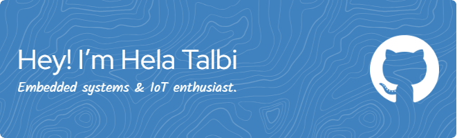

### Hi there 👋,I am Hela Talbi

---
I am a passionate student specializing in embedded systems, electronics, IoT, and embedded Linux. Currently, I am deepening my knowledge of STM32 through hands-on projects. This year, I discovered the world of Embedded Linux and the Yocto Project, which sparked my interest due to its significant impact on embedded systems. Since then, I have been continuously learning and building my skills in this field.

I am also exploring the integration of artificial intelligence into embedded systems, aiming to develop smart, efficient, and innovative solutions.

---

<!--
**hela45/hela45** is a ✨ _special_ ✨ repository because its `README.md` (this file) appears on your GitHub profile.-->
- 🌱 I’m currently learning  embedded Linux,YOCTO,STM32
- 👯 I’m looking to collaborate on others projects and learn other technologies
- ⚡ Fun fact: I love designing :eyes:
---
## <b> Connect with me:</b>

